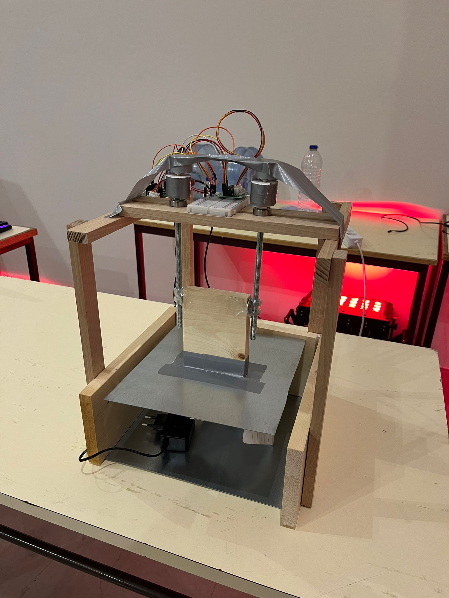
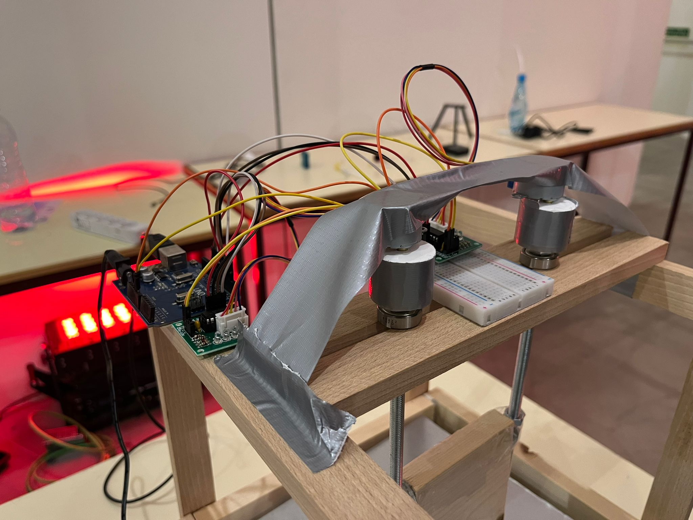

# SSWB-Prototype

Code developement for the creation of a miniature sized Solar Smart Waste Bin compactor prototype for the TecStorm 2024 competition in the Champalimaud Foundation in Lisbon. 

The finished prototype ended up looking like this.

    
    

